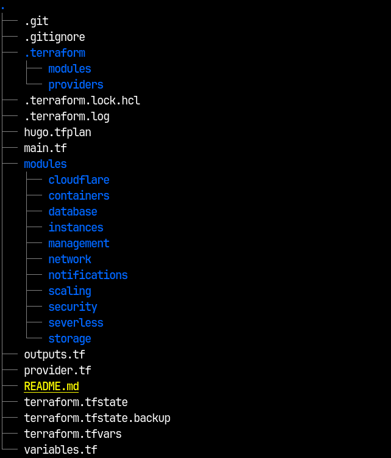
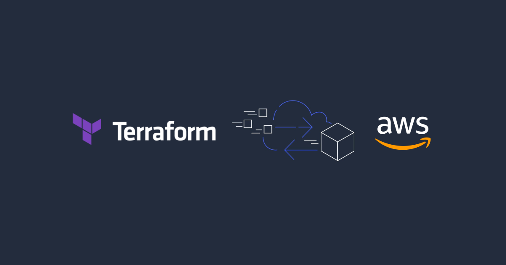
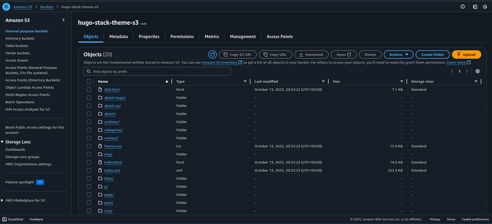
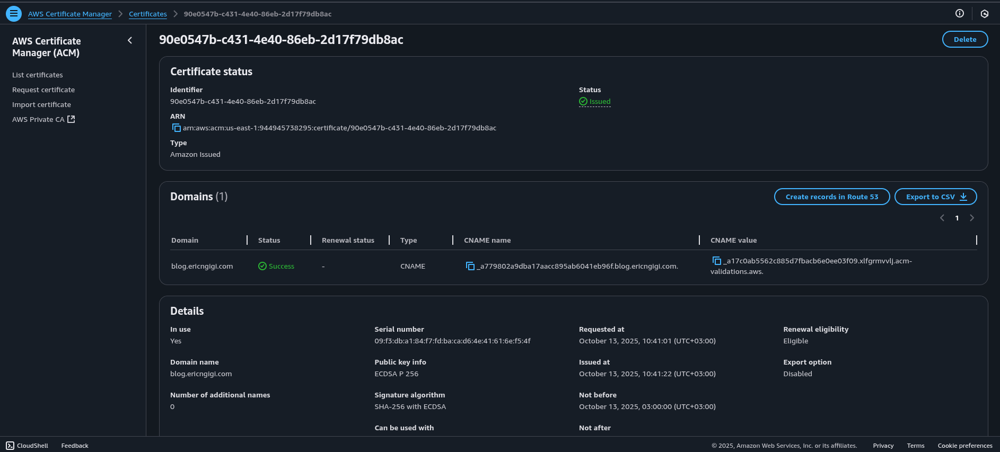
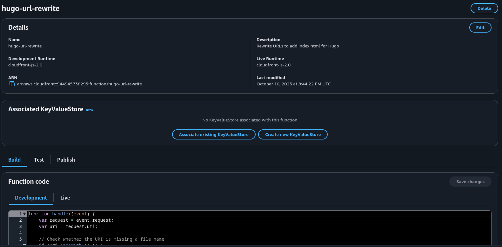

+++
author = "Eric Ngigi"
title = "Automating a Full CI/CD Pipeline for a Hugo Website with Terraform. Github Actions, AWS and Cloudflare"
date = "2025-10-13"
description = "Learn how to build, deploy, and deliver static files securely via OIDC to S3, distribute them globally with CloudFront, and connect a custom subdomain through Cloudflare with ACM-managed SSL. Achieve a fully automated, secure, and scalable workflow for continuous delivery."
tags = [
    "Terraform",
    "GitHub Actions",
    "AWS",
    "Cloudflare",
    "Hugo",
    "CI/CD",
]
categories = [
    "DevOps",
    "Infrastructure as Code",
    "Cloud Automation",
    "Continous Integration & Delivery"
]
series = ["DevOps Automation Series"]
image = "terraform-aws-ci-cd-0.png"
toc = false
readingTime = false
+++

## **1. Introduction**

In modern web development, automation has become a cornerstone of efficiency and reliability. Static site generators like **Hugo** make it easy to build fast, lightweight websites, but deploying and managing them securely and consistently can be challenging without proper automation. That’s where **Terraform**, **AWS**, **Cloudflare**, and **GitHub Actions** come together to create a fully automated and secure deployment pipeline.

This article walks through the automation of a **Hugo CI/CD pipeline** using **Terraform** to provision cloud resources and **GitHub Actions** to handle continuous integration and delivery. The pipeline builds Hugo’s static files, uploads them to **Amazon S3**, and serves them globally through **CloudFront** with SSL certificates managed by **AWS Certificate Manager (ACM)**. Finally, **Cloudflare** is used to map a custom subdomain to the CloudFront distribution, ensuring global accessibility and security via DNS and SSL integration.

By the end of this guide, you’ll understand how each Terraform module - **storage**, **network**, **security**, and **cloudflare** - fits together to form a complete infrastructure-as-code solution. You’ll see how to securely connect GitHub Actions to AWS using **OpenID Connect (OIDC)**, and how the modular Terraform approach keeps the setup scalable, maintainable, and reusable across projects.

## **2. Project Structure and Module Overview**



Before diving into the implementation, it’s important to understand how the Terraform configuration is organized. The project follows a modular design, where each core component of the infrastructure - storage, networking, security, and DNS - is defined as an independent Terraform module. This structure improves readability, reusability, and scalability, allowing you to make updates to one part of the infrastructure without affecting the others.

At the heart of the setup is the **`main.tf`** file, which serves as the orchestrator for all the modules. It defines how these modules interact, passing outputs from one module as inputs to another. For instance, the **storage** module creates the S3 bucket that hosts the Hugo-generated static files, and the **network** module consumes its details to configure a CloudFront distribution for global delivery. Similarly, the **security** module defines the IAM roles and OIDC permissions needed for GitHub Actions to deploy securely to AWS, while the **cloudflare** module manages DNS and SSL integration for the public-facing domain.

Each module encapsulates a specific function:

* **Storage Module:** Handles S3 bucket creation and access configuration for static site hosting.
* **Network Module:** Sets up CloudFront for content delivery and configures SSL certificates via AWS ACM.
* **Security Module:** Manages IAM roles, policies, and OIDC trust relationships for secure GitHub Actions deployments.
* **Cloudflare Module:** Connects Cloudflare DNS records to the CloudFront distribution and manages domain SSL validation.

This modular approach keeps the Terraform configuration clean, easier to maintain, and ideal for CI/CD workflows where each component can evolve independently. In the next sections, we’ll explore each module in detail and examine how they integrate to form a fully automated deployment pipeline for a Hugo website.

Excellent — since the **OIDC setup in AWS** must exist before GitHub Actions can assume the IAM role, the workflow of your article (and documentation) should start with **Terraform security and storage configuration**, then move on to the **GitHub Actions workflow**.

Below is the **reframed document**, organized to reflect this correct sequence. It first walks through the AWS-side setup using Terraform (security + storage modules) and then transitions into the GitHub Actions workflow where the OIDC role and S3 bucket are used.

## **Configuring AWS for Secure GitHub Actions Access (Terraform Setup)**

Before automating deployments with GitHub Actions, we first need to create the AWS resources that will **enable secure authentication** and **object storage** for our Hugo site. This foundation ensures that GitHub can deploy to AWS **without static access keys**, using **OpenID Connect (OIDC)** instead.

The Terraform configuration below lives in the **`security`** and **`storage`** modules, forming the security and storage backbone of the CI/CD pipeline.

### **1. Establishing OIDC Trust Between GitHub and AWS**

We start by defining an **OpenID Connect (OIDC) provider** in AWS that recognizes GitHub as a trusted identity source. This allows GitHub Actions workflows to assume roles in AWS using temporary tokens rather than permanent credentials.

**main.tf (security module):**

```hcl
# OIDC Provider for GitHub Actions
resource "aws_iam_openid_connect_provider" "github" {
  url = var.git_oidc_url

  client_id_list  = ["sts.amazonaws.com"]
  thumbprint_list = var.git_oidc_thumbprint_list
}
```

This resource registers GitHub’s identity provider (`token.actions.githubusercontent.com`) with AWS. The `thumbprint_list` ensures the TLS certificate used by GitHub is valid and trusted.

### **2. Creating the IAM Role for GitHub Actions**

Next, we define an **IAM role** that GitHub Actions will assume during deployment. The trust policy allows GitHub’s OIDC provider to assume the role, but only for a specific organization and repository.

```hcl
resource "aws_iam_role" "github_actions" {
  name = "github-actions-hugo-deploy"
  assume_role_policy = jsonencode({
    Version = "2012-10-17"
    Statement = [
      {
        Effect = "Allow"
        Principal = {
          Federated = aws_iam_openid_connect_provider.github.arn
        }
        Action = "sts:AssumeRoleWithWebIdentity"
        Condition = {
          StringEquals = {
            "token.actions.githubusercontent.com:aud" = "sts.amazonaws.com"
          }
          StringLike = {
            "token.actions.githubusercontent.com:sub" = "repo:${var.github_org}/${var.github_repo}:*"
          }
        }
      }
    ]
  })
  tags = {
    Name = "GitHub Actions Hugo Deploy Role"
  }
}
```

This configuration limits access to a specific repository, enforcing the **principle of least privilege**. Only workflows running in that repository can assume this role via OIDC.

**outputs.tf:**

```hcl
output "github_action_role_arn" {
  description = "ARN of the IAM role for GitHub Actions"
  value       = aws_iam_role.github_actions.arn
}
```

This ARN will be used later in the **GitHub Actions workflow** when configuring AWS credentials.

### **3. Creating the S3 Bucket for Hugo Site Hosting**

With the security layer in place, we define an S3 bucket to host the static site generated by Hugo.

**main.tf (storage module):**

```hcl
resource "aws_s3_bucket" "hugo_site" {
  bucket = "${var.project_name}-stack-theme-s3"

  tags = {
    Name = "Hugo Theme Stack Site"
  }
}
```

Additional configurations are added to enhance **security and compliance**:

* Block public access
* Enable server-side encryption
* Restrict CloudFront access

```hcl
resource "aws_s3_bucket_public_access_block" "hugo_site" {
  bucket = aws_s3_bucket.hugo_site.id

  block_public_acls       = true
  block_public_policy     = true
  ignore_public_acls      = true
  restrict_public_buckets = true
}

resource "aws_s3_bucket_server_side_encryption_configuration" "hugo_site" {
  bucket = aws_s3_bucket.hugo_site.id

  rule {
    apply_server_side_encryption_by_default {
      sse_algorithm = "AES256"
    }
  }
}
```

We also create a **bucket policy** allowing CloudFront to retrieve objects for content delivery:

```hcl
resource "aws_s3_bucket_policy" "hugo_site" {
  bucket = aws_s3_bucket.hugo_site.id

  policy = jsonencode({
    Version = "2012-10-17"
    Statement = [
      {
        Sid    = "AllowCloudFrontServicePrincipal"
        Effect = "Allow"
        Principal = {
          Service = "cloudfront.amazonaws.com"
        }
        Action   = "s3:GetObject"
        Resource = "${aws_s3_bucket.hugo_site.arn}/*"
        Condition = {
          StringEquals = {
            "AWS:SourceArn" = var.cloudfront_distribution_arn
          }
        }
      }
    ]
  })
}
```

**outputs.tf:**

```hcl
output "s3_bucket_arn" {
  description = "Resource output for the ARN value of the hugo s3 bucket"
  value       = aws_s3_bucket.hugo_site.arn
}

output "s3_bucket_name" {
  description = "Name of the s3 bucket"
  value       = aws_s3_bucket.hugo_site.id
}
```

### **4. Attaching IAM Policy to the GitHub Actions Role**

Finally, we grant GitHub Actions permissions to upload, list, and delete objects in the S3 bucket.

```hcl
resource "aws_iam_role_policy" "github_actions" {
  name = "github-actions-hugo-policy"
  role = aws_iam_role.github_actions.id

  policy = jsonencode({
    Version = "2012-10-17"
    Statement = [
      {
        Effect = "Allow"
        Action = [
          "s3:PutObject",
          "s3:GetObject",
          "s3:DeleteObject",
          "s3:ListBucket"
        ]
        Resource = [
          var.hugo_s3_bucket_arn,
          "${var.hugo_s3_bucket_arn}/*"
        ]
      }
    ]
  })
}
```

This IAM policy ensures that the GitHub workflow can safely interact with the S3 bucket — uploading the Hugo build output during deployment.

## **Connecting the Terraform Outputs to GitHub Actions**

With the Terraform configuration applied, AWS now has:

* A registered **OIDC provider** for GitHub
* An **IAM role** that can be assumed by your repository’s workflow
* A **secure S3 bucket** for static file hosting

From the Terraform outputs, we’ll use the following values in GitHub Actions secrets:

* `IAM_ROLE_ARN` → Output from `github_action_role_arn`
* `S3_BUCKET` → Output from `s3_bucket_name`
* `AWS_REGION` → Defined in Terraform or AWS provider

These secrets will allow GitHub Actions to assume the IAM role via OIDC and deploy directly to the bucket.

## **GitHub Actions Workflow: Building and Deploying the Hugo Site**

With the AWS side configured, we can now implement the **GitHub Actions workflow**. This workflow uses the IAM role and S3 bucket created by Terraform to automatically build and deploy the Hugo site.

The workflow file (`.github/workflows/build-hugo-site.yml`) performs the following tasks:

1. **Trigger on Push:** Runs on commits to the `dev` branch.
2. **Build Hugo:** Compiles static files with the specified Hugo version.
3. **Assume IAM Role via OIDC:** Authenticates securely with AWS.
4. **Deploy to S3:** Uploads the `public/` directory to the bucket.
5. **Invalidate CloudFront Cache:** Ensures global users see the latest version immediately.

```yaml
name: Build Hugo site
on:
  push:
    branches:
      - dev
permissions:
  id-token: write
  contents: read
jobs:
  build:
    runs-on: ubuntu-latest
    steps:
      - name: Checkout code
        uses: actions/checkout@v4
        with:
          submodules: recursive
          fetch-depth: 0
      - name: Setup Hugo
        uses: peaceiris/actions-hugo@v2
        with:
          hugo-version: "0.150.0"
          extended: true
      - name: Build minified pages
        run: hugo --gc --minify
      - name: Debug - List public directory contents
        run: |
          echo "=== Contents of public/ directory ==="
          ls -laR public/
          echo ""
          echo "=== HTML files found ==="
          find public/ -name "*.html" -type f
          echo ""
          echo "=== Total file count ==="
          find public/ -type f | wc -l
      - name: Configure AWS Credentials
        if: github.event_name != 'pull_request'
        uses: aws-actions/configure-aws-credentials@v4
        with:
          aws-region: ${{ secrets.AWS_REGION }}
          role-to-assume: ${{ secrets.IAM_ROLE_ARN }}
      - name: Debug AWS credentials
        if: github.event_name != 'pull_request'
        run: |
          aws sts get-caller-identity
      - name: Sync public directory with S3 bucket
        run: |
          aws s3 sync ./public s3://${{ secrets.S3_BUCKET }} --delete
      - name: Invalidate CloudFront cache
        if: github.event_name != 'pull_request'
        uses: aws-actions/configure-aws-credentials@v4
        with:
          role-to-assume: ${{ secrets.AWS_ROLE_ARN }}
          aws-region: ${{ secrets.AWS_REGION }}
        continue-on-error: true
      - name: Create CloudFront invalidation
        if: github.event_name != 'pull_request'
        run: |
          aws cloudfront create-invalidation \
            --distribution-id ${{ secrets.CLOUDFRONT_DISTRIBUTION_ID }} \
            --paths "/*"
        continue-on-error: true
      - name: Build Summary
        if: github.event_name != 'pull_request'
        run: |
          echo "### Deployment Successful! :rocket:" >> $GITHUB_STEP_SUMMARY
```

### **Workflow Overview**

The workflow resides in `.github/workflows/build-hugo-site.yml` and performs these primary functions:

1. **Triggering Conditions**
   The workflow runs on a push to the `dev` branch. This allows developers to test and validate changes in a development environment before they are promoted to production.

2. **Permissions Configuration**
   Permissions are configured to allow GitHub Actions to generate an **OIDC token** (`id-token: write`) and access repository contents (`contents: read`). The OIDC token is crucial because it enables secure, short-lived authentication with AWS — eliminating the need for static credentials.

### **Job: Build**

The `build` job runs on an Ubuntu-based GitHub Actions runner (`ubuntu-latest`) and executes the core CI/CD steps.

#### **1. Checkout Code**

```yaml
- name: Checkout code
  uses: actions/checkout@v4
  with:
    submodules: recursive
    fetch-depth: 0
```

This step retrieves the source code from the repository, including any submodules (such as Hugo themes), ensuring the full codebase is available for the build.

#### **2. Setup Hugo**

```yaml
- name: Setup Hugo
  uses: peaceiris/actions-hugo@v2
  with:
    hugo-version: "0.150.0"
    extended: true
```

Here we install the specific Hugo version required for the build. Using a defined version guarantees consistency between local and CI builds.

#### **3. Build and Optimize Site**

```yaml
- name: Build minified pages
  run: hugo --gc --minify
```

This command generates the static site files in the `public/` directory, removing unused assets (`--gc`) and minifying the output (`--minify`) for optimal performance.

#### **4. Debugging Build Output**

```yaml
- name: Debug - List public directory contents
  run: |
    echo "=== Contents of public/ directory ==="
    ls -laR public/
    ...
```

A diagnostic step to inspect the build output before deployment. This helps identify missing or misconfigured assets early in the pipeline.

#### **5. Configure AWS Credentials via OIDC**

```yaml
- name: Configure AWS Credentials
  uses: aws-actions/configure-aws-credentials@v4
  with:
    aws-region: ${{ secrets.AWS_REGION }}
    role-to-assume: ${{ secrets.IAM_ROLE_ARN }}
```

This step allows GitHub Actions to assume an AWS IAM role securely via **OpenID Connect (OIDC)**. Unlike static AWS keys, OIDC tokens are short-lived and automatically managed, improving security posture.

#### **6. Verify AWS Connection**

```yaml
- name: Debug AWS credentials
  run: aws sts get-caller-identity
```

This command confirms successful authentication with AWS and verifies which IAM role the workflow is using.

#### **7. Deploy Static Files to S3**

```yaml
- name: Sync public directory with S3 bucket
  run: aws s3 sync ./public s3://${{ secrets.S3_BUCKET }} --delete
```

Uploads all generated files from the `public/` directory to the specified S3 bucket. The `--delete` flag ensures the bucket mirrors the latest build exactly by removing outdated files.

#### **8. CloudFront Cache Invalidation**

```yaml
- name: Create CloudFront invalidation
  run: |
    aws cloudfront create-invalidation \
      --distribution-id ${{ secrets.CLOUDFRONT_DISTRIBUTION_ID }} \
      --paths "/*"
```

Invalidates the CloudFront cache so users immediately see updated content after each deployment.

#### **9. Build Summary**

```yaml
- name: Build Summary
  run: |
    echo "### Deployment Successful! :rocket:" >> $GITHUB_STEP_SUMMARY
```

Displays a confirmation message in the GitHub Actions summary, signaling a successful deployment.

### **Why This Step Comes First**

This workflow forms the **foundation** of the CI/CD pipeline. It ensures that:

* Hugo site builds can be automated and verified directly in GitHub.
* Secure OIDC-based authentication with AWS is already in place.
* The deployment process (S3 upload + CloudFront invalidation) is tested and working before Terraform provisions or manages any infrastructure.

## **Setting Up the Network Module: CloudFront Distribution and SSL Certificate**

With the static Hugo site now securely stored in **Amazon S3**, the next step is to distribute it globally and serve it over HTTPS. We achieve this using **Amazon CloudFront** — AWS’s Content Delivery Network (CDN) — and **AWS Certificate Manager (ACM)** for SSL/TLS certificates.

This section focuses on defining the **network module** in Terraform, which provisions the CloudFront distribution, origin access control (OAC), a function for clean URLs, and the SSL certificate required for HTTPS.

### **1. CloudFront Origin Access Control (OAC)**

The first resource in this module is the **Origin Access Control (OAC)**, which replaces the older OAI mechanism. It ensures CloudFront can securely fetch files from the S3 bucket using signed requests, while preventing direct public access.

```hcl
resource "aws_cloudfront_origin_access_control" "hugo_site" {
  name                              = "${var.s3_bucket_name}-oac"
  description                       = "OAC for the hugo site"
  origin_access_control_origin_type = "s3"
  signing_behavior                  = "always"
  signing_protocol                  = "sigv4"
}
```

### **2. CloudFront Function for Clean URLs**

Next, we define a **CloudFront Function** to handle “clean URLs.” Since Hugo generates content as `index.html` within folders, this function rewrites incoming requests to point to the correct file.

```hcl
resource "aws_cloudfront_function" "url_rewrite" {
  name    = "hugo-url-rewrite"
  runtime = "cloudfront-js-2.0"
  comment = "Rewrite URLs to add index.html for Hugo"
  publish = true
  code    = <<-EOT
function handler(event) {
    var request = event.request;
    var uri = request.uri;
    
    if (uri.endsWith('/')) {
        request.uri += 'index.html';
    } 
    else if (!uri.includes('.')) {
        request.uri += '/index.html';
    }
    
    return request;
}
EOT
}
```

This allows users to access `/about/` instead of `/about/index.html`, providing a cleaner and more professional URL structure.

### **3. CloudFront Distribution Configuration**

The **CloudFront distribution** connects the CDN to the S3 origin, enforces HTTPS, enables caching, and associates the custom subdomain.

```hcl
resource "aws_cloudfront_distribution" "hugo_site" {
  enabled             = true
  is_ipv6_enabled     = true
  default_root_object = "index.html"
  price_class         = "PriceClass_100"
  comment             = "Hugo site distribution"
  http_version        = "http2and3"

  aliases = ["${var.subdomain_name}.${var.domain_name}"]

  origin {
    domain_name              = var.s3_bucket_regional_domain_name
    origin_id                = "S3-${var.s3_bucket_name}"
    origin_access_control_id = aws_cloudfront_origin_access_control.hugo_site.id
  }

  default_cache_behavior {
    allowed_methods  = ["GET", "HEAD", "OPTIONS"]
    cached_methods   = ["GET", "HEAD"]
    target_origin_id = "S3-${var.s3_bucket_name}"

    forwarded_values {
      query_string = false
      cookies {
        forward = "none"
      }
    }

    function_association {
      event_type   = "viewer-request"
      function_arn = aws_cloudfront_function.url_rewrite.arn
    }

    viewer_protocol_policy = "redirect-to-https"
    min_ttl                = 0
    default_ttl            = 3600
    max_ttl                = 86400
    compress               = true
  }

  custom_error_response {
    error_code         = 404
    response_code      = 404
    response_page_path = "/404.html"
  }

  custom_error_response {
    error_code         = 403
    response_code      = 404
    response_page_path = "/404.html"
  }

  restrictions {
    geo_restriction {
      restriction_type = "none"
    }
  }

  viewer_certificate {
    acm_certificate_arn      = aws_acm_certificate.hugo_site.arn
    ssl_support_method       = "sni-only"
    minimum_protocol_version = "TLSv1.2_2021"
  }

  tags = {
    Name = "Hugo Site Distribution"
  }
}
```

This configuration enforces HTTPS, compresses content for faster delivery, and integrates directly with ACM for secure SSL termination.

### **4. SSL Certificate with AWS Certificate Manager (ACM)**

Before CloudFront can serve HTTPS traffic, a valid certificate must be provisioned. We use **AWS Certificate Manager (ACM)** for this, specifying DNS validation for automatic verification.

```hcl
resource "aws_acm_certificate" "hugo_site" {
  domain_name       = "${var.subdomain_name}.${var.domain_name}"
  validation_method = "DNS"
  key_algorithm     = "EC_prime256v1"

  options {
    certificate_transparency_logging_preference = "ENABLED"
  }

  lifecycle {
    create_before_destroy = true
  }

  tags = {
    Name = "Hugo Site Certificate"
  }
}
```

> **Note:** For CloudFront, the ACM certificate must always be created in the **us-east-1** region.

### **5. Network Module Outputs**

Once the resources are deployed, several key outputs from the **network module** are required by other Terraform modules — including Cloudflare for DNS and validation setup.

```hcl
output "cloudfront_distribution_arn" {
  description = "Resource output for the cloudfront distribution arn"
  value       = aws_cloudfront_distribution.hugo_site.arn
}

output "cloudfront_distribution_id" {
  description = "CloudFront distribution ID"
  value       = aws_cloudfront_distribution.hugo_site.id
}

output "cloudfront_domain_name" {
  description = "CloudFront distribution URL (HTTPS)"
  value       = aws_cloudfront_distribution.hugo_site.domain_name
}

output "acm_validation_options" {
  description = "ACM certificate validation DNS records"
  value = [
    for dvo in aws_acm_certificate.hugo_site.domain_validation_options : {
      name  = dvo.resource_record_name
      type  = dvo.resource_record_type
      value = dvo.resource_record_value
    }
  ]
}
```

These outputs provide critical data that downstream modules—like **Cloudflare**—will consume to finalize DNS setup and SSL validation. The **`acm_validation_options`** in particular are used to automatically create DNS records for certificate validation.

Excellent — this is the final major section of your Terraform-based CI/CD pipeline article. Below is a clean, professional draft for the **Cloudflare Configuration** section that fits seamlessly into your existing documentation flow.

## **Configuring Cloudflare: DNS, SSL Validation, and Subdomain Binding**

With the CloudFront distribution and SSL certificate in place, the final step is to make the site accessible through your custom domain. We’ll use **Cloudflare** to manage DNS records, handle ACM certificate validation, and securely bind the subdomain to the CloudFront URL.

This configuration allows Cloudflare to act as a DNS and security layer—enabling global caching, DDoS protection, and HTTPS enforcement on top of AWS CloudFront.

### **1. Fetching Zone Information**

Before adding any DNS records, Terraform must retrieve details about your Cloudflare-managed domain. The following data block fetches the zone ID based on the domain name provided as a variable (`var.domain_name`):

```hcl
data "cloudflare_zones" "zone" {
  name = var.domain_name
}
```

Once the zone information is available, a secondary data source lists all existing DNS records in that zone. This is useful when validating or filtering existing records to avoid conflicts.

```hcl
data "cloudflare_dns_records" "all" {
  zone_id = data.cloudflare_zones.zone.result[0].id
}
```

### **2. Automating ACM Certificate Validation**

When AWS Certificate Manager issues an SSL certificate for CloudFront, it requires DNS-based validation.
To automate this process, Terraform dynamically creates the necessary DNS records in Cloudflare using the outputs from the **network module** (`acm_validation_options`).

```hcl
resource "cloudflare_dns_record" "acm_validation" {
  for_each = {
    for idx, record in var.acm_validation_options : idx => record
  }

  zone_id = data.cloudflare_zones.zone.result[0].id
  name    = trimsuffix(each.value.name, ".")
  type    = each.value.type
  content = trimsuffix(each.value.value, ".")
  ttl     = 60
  proxied = false

  comment = "ACM certificate validation for ${var.subdomain_name}.${var.domain_name}"
}
```

Each record generated by this block corresponds to a validation entry required by ACM.
Once these DNS records propagate, ACM automatically verifies domain ownership and issues the SSL certificate used by CloudFront.

### **3. Binding the Subdomain to CloudFront**

After the SSL certificate is validated, we can now point the subdomain (e.g., `blog.example.com`) to the CloudFront distribution.
The record below creates a **CNAME** entry in Cloudflare that maps the subdomain to CloudFront’s domain name, enabling public access to the static site.

```hcl
resource "cloudflare_dns_record" "hugo_site" {
  zone_id = data.cloudflare_zones.zone.result[0].id
  name    = var.subdomain_name
  ttl     = 1
  type    = "CNAME"
  content = var.cloudfront_url
  proxied = true

  comment = "Hugo site on CloudFront with Cloudflare SSL"

  depends_on = [cloudflare_dns_record.acm_validation]
}
```

Here’s what’s happening:

* **`type = "CNAME"`**: Points your subdomain to the CloudFront distribution.
* **`proxied = true`**: Routes traffic through Cloudflare, enabling SSL, caching, and security features.
* **`depends_on`** ensures the DNS validation records are created first, allowing ACM verification to complete before exposing the public domain.

### **4. Completing the CI/CD Pipeline**

At this point, your **Hugo static website** is:

* Built automatically via **GitHub Actions** and deployed to **Amazon S3**.
* Distributed globally through **AWS CloudFront** with an ACM-managed SSL certificate.
* Connected to a **custom subdomain** via **Cloudflare**, ensuring secure and performant access.

This final step completes the end-to-end automation of your CI/CD pipeline—combining Terraform’s Infrastructure as Code, GitHub Actions’ automation, and the scalability of AWS and Cloudflare.

### **Next Steps**

* Verify ACM certificate issuance in the **AWS Certificate Manager console**.
* Test your domain in a browser (e.g., `https://blog.example.com`) to confirm HTTPS and caching are active.
* Optionally, enhance your setup with Cloudflare Page Rules, caching policies, or custom error pages.

    
